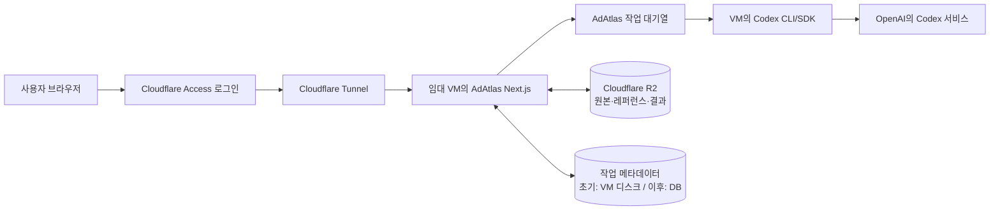

# AdAtlas 서버 배포 및 Cloudflare 저장소 이전 가이드

작성 기준일: 2026-09-07  
대상: 현재 `/Users/joyedam/adatlas` 저장소를 처음 배포하는 운영자

## 1. 가장 먼저 이해할 결론

AdAtlas를 다른 사람도 사용할 수 있게 만들 때 필요한 것은 크게 세 부분입니다.

1. **웹사이트와 제작 프로그램을 실행하는 임대 컴퓨터**
   - Ubuntu가 설치된 VPS 또는 클라우드 VM 한 대
   - Next.js, 작업 대기열, Codex CLI/SDK가 여기서 실행됩니다.
2. **이미지와 ZIP을 보관하는 파일 저장소**
   - Cloudflare R2를 사용합니다.
   - 레퍼런스 원본, 상품 원본, 완성 광고, 다운로드 ZIP을 보관합니다.
3. **사이트에 들어오는 사용자를 제한하고 연결하는 입구**
   - Cloudflare Tunnel과 Cloudflare Access를 사용합니다.
   - 초대된 이메일만 사이트에 접속하도록 만들 수 있습니다.

Cloudflare Workers는 현재 AdAtlas의 Codex 생성기를 실행할 일반 컴퓨터가 아닙니다. 현재 코드는 Node.js 자식 프로세스로 로컬 Codex CLI를 실행하고 로컬 파일을 계속 읽고 쓰므로, **생성 프로그램은 상시 실행되는 VM에 두는 것이 맞습니다.**

처음부터 UI를 새로 만들지는 않습니다. 현재 `localhost:3000`의 AdAtlas UI와 API를 같은 코드로 VM에서 실행하고, 사용자는 `https://app.내도메인.com`으로 접속합니다.



## 2. “테스트 공개”와 “정식 다중 사용자 서비스”는 다릅니다

### A. 초대 사용자용 테스트 공개

지인이나 내부 담당자 몇 명이 같은 AdAtlas 작업공간을 함께 쓰는 단계입니다.

- Cloudflare Access에서 허용 이메일만 등록합니다.
- 사이트 전체를 로그인 뒤에 둡니다.
- VM은 한 대만 사용합니다.
- Codex 실행기도 VM 한 곳에서만 실행합니다.
- 모든 사용자가 같은 레퍼런스 풀과 아카이브를 보는 형태로 시작할 수 있습니다.

이 단계가 가장 먼저 진행하기 좋습니다. Cloudflare Access는 자체 로그인 화면과 이메일 OTP를 제공할 수 있습니다. 다만 허용 이메일 목록을 반드시 제한해야 합니다.

### B. 정식 다중 사용자 서비스

서로 모르는 고객이 가입하고, 각자 자신의 상품과 결과만 보는 단계입니다.

이 단계에는 추가 개발이 필요합니다.

- 앱 내부 회원 및 조직 계정
- 모든 작업·상품·파일에 `userId` 또는 `workspaceId` 저장
- 사용자별 파일 접근 검사
- 사용자별 생성량과 동시 실행 제한
- 결제·플랜·관리자 권한
- 탈퇴·삭제·보존 기간 정책

Cloudflare Access만 붙였다고 사용자 데이터가 자동으로 분리되지는 않습니다. 현재 AdAtlas에는 사용자별 데이터 소유권 구조가 없으므로, **외부 고객에게 공개하기 전에 반드시 앱 내부 데이터 분리를 구현해야 합니다.**

## 3. 현재 AdAtlas를 확인한 결과

현재 저장소는 다음 구조입니다.

- Next.js `16.2.9`, React `19.2.4`, TypeScript
- `npm run build`는 `next build --webpack`
- `npm run start`는 프로덕션 Next.js 서버 실행
- `instrumentation.ts`에서 서버 시작 시 자동 제작, 중단 작업 복구, OCR 복구, Codex 세션 정리를 시작
- `@openai/codex-sdk`와 설치된 Codex CLI를 함께 사용
- `codex login status` 결과가 ChatGPT 로그인인지 확인
- Codex 실행 자식 프로세스에는 API 키를 의도적으로 전달하지 않음
- 생성 작업과 결과는 로컬 디스크의 JSON 및 이미지 파일로 저장
- 생성 API는 현재 외부 호스트를 의도적으로 차단하고 localhost만 허용
- 앱 전체를 보호하는 회원 로그인 또는 사용자별 테넌트 구분은 아직 없음

2026-09-07 확인 당시 주요 로컬 데이터는 다음과 같습니다. 크기는 계속 변할 수 있습니다.

| 현재 위치                                     | 내용                        |            확인 당시 규모 | 현재 Git 포함 여부 |
| --------------------------------------------- | --------------------------- | ------------------------: | ------------------ |
| `.data/generated/`                            | 생성 중간물·최종 이미지     |                  약 8.3GB | 제외               |
| `.data/creative-generation/`                  | 광고 생성 작업 JSON         | 약 138MB, 작업 파일 346개 | 제외               |
| `data/auto-production/runtime/`               | 자동 제작 실행 기록         |                  약 129MB | 제외               |
| `public/creative-references/reference-copy/`  | 제작 레퍼런스 이미지        |            약 70MB, 386개 | 포함               |
| `data/native-creative-reference-library.json` | 레퍼런스 OCR·분류·선택 정보 |                386개 항목 | 포함               |
| `public/processed-products/`                  | 가공 상품 이미지            |                   약 53MB | 제외               |
| `.data/category-creatives/`                   | 카테고리 소재 작업·원본     |                  약 4.2MB | 제외               |
| `.data/ad-copy/`                              | 아카이브 광고 문구          |                  약 536KB | 제외               |
| `.data/creative-archive/`                     | 아카이브 메타데이터·인덱스  |                  약 1.4MB | 일부 제외          |

레퍼런스 manifest에는 현재 식품 216개, 화장품 170개가 등록되어 있습니다.

### 지금 그대로 외부 공개하면 안 되는 이유

1. 외부 사용자가 생성 API를 호출하면 현재 localhost 보호 규칙 때문에 제작이 거절됩니다.
2. localhost 보호 규칙만 지워버리면 인증되지 않은 사람이 생성 API를 호출할 수 있습니다.
3. JSON 파일 저장은 여러 요청이 동시에 들어오는 다중 사용자 환경에서 충돌할 수 있습니다.
4. 현재 `public/creative-references/`는 배포 시 정적 공개 파일이 됩니다.
5. 사용자 A가 사용자 B의 작업 ID를 알게 되었을 때 접근을 차단하는 소유권 검사가 없습니다.
6. Git clone만 하면 `.data/`와 Git에서 제외된 이미지·실행 기록은 서버로 복사되지 않습니다.

따라서 **서버 계약부터 하고 파일을 바로 올리는 것이 아니라, 배포 준비 코드를 먼저 완성한 뒤 올려야 합니다.**

## 4. 최종적으로 무엇을 어디에 두는가

| 항목                              | 최종 위치                                 | 이유                                                                     |
| --------------------------------- | ----------------------------------------- | ------------------------------------------------------------------------ |
| `app/`, `scripts/`, 설정 코드     | GitHub 저장소 + VM clone                  | 코드는 Git으로 배포하며, 고객 데이터를 받기 전 비공개 저장소 사용을 권장 |
| 폰트, 로고, 일반 UI 정적 파일     | Next.js `public/`                         | 앱 빌드에 포함해도 되는 공개 자산                                        |
| 광고 레퍼런스 원본 386장          | 비공개 R2                                 | 외부에 직접 공개하지 않고 공용 제작 풀로 사용                            |
| 레퍼런스 OCR·분류 manifest        | DB 또는 버전 관리된 비공개 manifest       | 관리자 수정과 동시 접근을 안전하게 처리                                  |
| 상세페이지에서 가져온 상품 원본   | 비공개 R2                                 | 사용자가 선택한 원본을 변경 없이 보관                                    |
| 선택한 2·3·4번 첨부 이미지        | 비공개 R2                                 | 재시도해도 동일한 입력 유지                                              |
| 최종 1200×1200 광고               | 비공개 R2                                 | 아카이브와 다운로드에 사용                                               |
| ZIP 파일                          | 비공개 R2                                 | 서버 재시작과 무관하게 다운로드 유지                                     |
| 생성 중 임시 PNG/JPEG             | VM 임시 작업 폴더                         | 생성이 끝나면 정리 가능                                                  |
| 작업 상태·결과 경로·사용자 소유권 | DB                                        | 대기열·복구·권한 검사에 필요                                             |
| `.env.local`에 있던 비밀값        | VM의 권한 제한 환경 파일 또는 비밀 저장소 | Git과 R2에 절대 업로드하지 않음                                          |
| Codex 로그인 정보                 | VM에서 새로 `codex login`                 | Mac의 로그인 폴더를 복사하지 않음                                        |
| 서버 로그                         | VM의 systemd journal                      | 오류 추적과 운영 확인                                                    |

### 권장 R2 객체 경로

원본은 절대 같은 키에 덮어쓰지 않습니다. 파일 해시 또는 고유 ID를 사용합니다.

```text
references/{referenceId}/original.jpg
references/{referenceId}/thumbnail.jpg
workspaces/{workspaceId}/products/{productId}/sources/{assetId}.jpg
workspaces/{workspaceId}/jobs/{jobId}/inputs/02-product.png
workspaces/{workspaceId}/jobs/{jobId}/inputs/03-supporting.png
workspaces/{workspaceId}/jobs/{jobId}/inputs/04-packaging.png
workspaces/{workspaceId}/jobs/{jobId}/results/{resultId}/final.jpg
workspaces/{workspaceId}/jobs/{jobId}/downloads/all.zip
```

R2 버킷은 공개하지 않습니다. 브라우저에는 로그인과 소유권 검사를 통과한 뒤 짧은 유효기간의 다운로드 URL을 제공하거나, AdAtlas 이미지 API가 R2 파일을 대신 전달합니다.

## 5. 업로드하면 안 되는 것

다음 파일은 GitHub, R2 또는 공개 폴더에 업로드하지 않습니다.

- `.env.local`, `.env.production`, API 키가 들어 있는 모든 파일
- Mac의 `~/.codex` 로그인 파일
- Cloudflare 계정 전체 권한 인증서
- Google·Meta·Crema 서비스 계정 JSON과 토큰
- `node_modules/`
- `.next/`
- `*.log`, `*.tmp`, 손상된 `.corrupt-*` 세션 파일
- 고객 상품 원본을 `public/` 아래에 둔 파일

서버의 Codex 로그인은 서버 터미널에서 새로 수행합니다. Mac의 Codex 인증 파일을 압축해서 올리지 않습니다.

## 6. 권장 진행 순서

전체 작업을 한 번에 바꾸지 않고 아래 순서로 진행합니다.

### 0단계: 지금 상태 백업

이 단계에서는 삭제하지 않습니다.

1. 현재 Git 작업이 모두 커밋되어 있는지 확인합니다.
2. `.data/`, `data/auto-production/runtime/`, `public/processed-products/`를 외장 디스크 또는 별도 백업 위치에 복사합니다.
3. `data/native-creative-reference-library.json`과 `public/creative-references/reference-copy/`를 함께 백업합니다.
4. 파일 수와 전체 크기를 기록합니다.
5. 기존 Mac은 서버 전환이 끝난 뒤에도 일정 기간 복구용으로 유지합니다.

현재 GitHub 저장소가 공개 상태라면 먼저 공개 여부와 레퍼런스 이미지의 사용 권한을 확인합니다. 나중에 파일을 Git에서 지워도 과거 Git 이력에 남을 수 있으므로, 고객 상품 이미지나 비밀값은 처음부터 커밋하지 않습니다.

확인 명령:

```bash
cd /Users/joyedam/adatlas
git status
du -sh .data data/auto-production/runtime public/creative-references public/processed-products
find public/creative-references/reference-copy -type f | wc -l
find .data/generated -type f | wc -l
```

### 1단계: 배포 준비 코드 구현

이 단계는 Codex가 현재 저장소에서 구현할 수 있는 부분입니다.

1. 파일 저장 인터페이스를 만듭니다.
   - 로컬 개발용 `LocalObjectStorage`
   - 서버 운영용 `R2ObjectStorage`
2. 생성기에서 직접 `readFile`·`writeFile`로 최종 파일을 다루는 부분을 저장 인터페이스로 교체합니다.
3. 작업 JSON 저장소를 DB 저장소로 교체하거나, 첫 내부 테스트에서는 VM 단일 디스크 저장을 유지합니다.
4. 모든 작업과 파일에 `workspaceId`를 저장합니다.
5. 모든 조회·다운로드·수정 API가 현재 사용자의 `workspaceId`와 일치하는지 검사합니다.
6. `localhost` 전용 생성 보호를 단순 삭제하지 않고 인증된 사용자·내부 러너 토큰 검사로 교체합니다.
7. 하나의 작업이 두 번 실행되지 않도록 DB 잠금 또는 lease를 둡니다.
8. 기존 수동·자동 제작은 동일한 서버 작업 러너 한 곳만 사용합니다.
9. R2 장애가 발생하면 유료 API나 다른 이미지로 자동 우회하지 않고 작업을 재시도 가능 상태로 남깁니다.

#### 데이터베이스는 어떻게 시작할까

처음 초대 사용자 테스트에서는 다음처럼 단계화하는 것이 안전합니다.

- 1차: VM 한 대의 영속 디스크에 기존 JSON 저장 유지 + 매일 스냅샷
- 2차: 사용자와 동시 작업이 늘기 전에 D1 또는 PostgreSQL로 이전

D1을 선택하면 Cloudflare Worker binding 또는 D1 HTTP/REST 경로를 통해 VM과 연결해야 합니다. D1은 필수가 아니며, R2만 먼저 적용해도 됩니다. 한 번에 이미지 저장소와 모든 JSON 저장소를 동시에 변경하지 않는 편이 복구가 쉽습니다.

### 2단계: 임대 VM 준비

초보자에게는 AWS Lightsail의 Linux 인스턴스처럼 관리 화면이 단순한 VPS가 편합니다. 다른 업체의 Ubuntu VPS도 동일하게 사용할 수 있습니다.

권장 시작 사양:

- 운영체제: Ubuntu LTS 64비트
- CPU: 4 vCPU 권장
- 메모리: 8GB 권장
- 디스크: 80GB 이상
- 위치: 사용자와 가까운 아시아 리전
- GPU: 현재처럼 원격 Codex 서비스가 이미지를 생성한다면 불필요
- 자동 스냅샷: 활성화

이 값은 초기 초대 사용자 테스트 기준입니다. 이미지 생성 자체보다 Playwright, Next.js 빌드, Sharp 이미지 변환, 동시 작업 3개가 메모리를 사용합니다.

VM을 만든 뒤 다음 정보를 별도 암호관리 도구에 기록합니다.

- VM 이름
- 공급자 계정
- 서버 IP
- SSH 사용자 이름
- SSH 개인키 위치
- 리전
- 디스크 크기

#### 도메인이 아직 없다면

다른 사람이 기억하기 쉬운 주소로 접속하려면 `내도메인.com` 같은 도메인이 하나 필요합니다.

1. Cloudflare Registrar 또는 다른 도메인 판매처에서 도메인을 구입합니다.
2. 다른 판매처에서 샀다면 Cloudflare가 안내하는 nameserver로 변경합니다.
3. Cloudflare Dashboard에서 해당 도메인이 `Active`인지 확인합니다.
4. 실제 AdAtlas 주소는 `app.내도메인.com` 같은 서브도메인으로 정합니다.
5. Tunnel을 만들 때 이 서브도메인을 연결하므로, 지금 서버 IP를 DNS에 직접 노출할 필요는 없습니다.

도메인은 R2 버킷과 다른 항목입니다. 도메인은 사용자가 들어오는 주소이고, R2는 파일을 저장하는 공간입니다.

SSH 개인키를 GitHub나 R2에 올리지 않습니다.

### 3단계: Cloudflare R2 준비

Cloudflare Dashboard에서 다음 순서로 진행합니다.

1. `Storage & databases` → `R2` → `Overview`
2. R2 구독을 활성화합니다.
3. `Create bucket`을 누릅니다.
4. 버킷 이름을 `adatlas-prod-private`처럼 지정합니다.
5. Public access는 켜지 않습니다.
6. `Manage in API Tokens`로 이동합니다.
7. 해당 버킷 하나에만 `Object Read & Write`가 가능한 토큰을 만듭니다.
8. 다음 값을 한 번만 안전하게 보관합니다.
   - Account ID
   - Access Key ID
   - Secret Access Key
   - S3 endpoint
   - Bucket name

운영 환경 변수 예시입니다. 실제 값은 문서나 Git에 쓰지 않습니다.

```env
ADATLAS_OBJECT_STORAGE=r2
R2_ACCOUNT_ID=<Cloudflare Account ID>
R2_ACCESS_KEY_ID=<버킷 제한 Access Key>
R2_SECRET_ACCESS_KEY=<버킷 제한 Secret Key>
R2_BUCKET=adatlas-prod-private
R2_ENDPOINT=https://<ACCOUNT_ID>.r2.cloudflarestorage.com
```

현재 저장소에는 R2 연결 코드가 없으므로, 버킷을 만든 직후 이미지를 Dashboard에서 하나씩 올리지 않습니다. 먼저 1단계의 R2 저장 어댑터와 검증 가능한 마이그레이션 스크립트를 구현합니다.

### 4단계: 서버에 프로그램 설치

아래 명령은 VM을 만든 뒤 서버의 SSH 터미널에서 실행합니다. 배포 당시 운영체제와 공식 설치 안내에 맞게 패키지 명령을 확인합니다.

#### 4-1. 기본 도구 설치

```bash
sudo apt update
sudo apt install -y git build-essential ca-certificates curl
```

Next.js 16은 Node.js 20.9 이상이 필요합니다. 아래는 Ubuntu에 Node.js 22 LTS를 시스템 패키지로 설치하는 예시입니다. 배포 시점에 Node.js 공식 다운로드 페이지에서 현재 LTS와 설치 방법을 다시 확인합니다.

```bash
curl -fsSL https://deb.nodesource.com/setup_22.x -o /tmp/nodesource_setup.sh
sudo -E bash /tmp/nodesource_setup.sh
sudo apt install -y nodejs
```

설치 버전을 확인합니다.

```bash
node --version
npm --version
```

`node --version`이 `v20.9.0`보다 낮으면 다음 단계로 진행하지 않습니다.

#### 4-2. 전용 운영 사용자와 폴더

예시:

```bash
sudo adduser --disabled-password --gecos "" adatlas
sudo mkdir -p /srv/adatlas
sudo chown -R adatlas:adatlas /srv/adatlas
```

이후 앱과 Codex는 같은 `adatlas` 사용자로 실행해야 합니다. 다른 사용자로 Codex에 로그인하면 systemd에서 해당 로그인을 찾지 못할 수 있습니다.

#### 4-3. GitHub 코드 가져오기

저장소가 비공개라면 서버 전용 GitHub deploy key를 발급합니다. 개인 GitHub 비밀번호를 서버에 저장하지 않습니다.

1. 서버의 `adatlas` 사용자로 SSH 키를 만듭니다.
2. 공개키만 GitHub 저장소의 `Settings` → `Deploy keys`에 읽기 전용으로 등록합니다.
3. 개인키는 서버 밖으로 복사하거나 채팅에 붙여넣지 않습니다.

서버에서 실행:

```bash
sudo -iu adatlas
ssh-keygen -t ed25519 -C "adatlas-production" -f ~/.ssh/id_ed25519
cat ~/.ssh/id_ed25519.pub
```

화면에 나온 **공개키 한 줄**을 GitHub Deploy key에 등록한 다음 다시 서버에서 실행합니다.

```bash
cd /srv
git clone git@github.com:Joxxdam/adatlas.git
cd /srv/adatlas
npm ci
```

Git clone으로 가져오는 것은 코드와 Git이 추적하는 파일뿐입니다. `.data/`, 서버 비밀값, Git에서 제외된 상품 이미지와 자동 제작 기록은 따라오지 않습니다.

#### 4-4. Playwright 브라우저 준비

상세페이지 분석에 Playwright가 필요합니다.

```bash
cd /srv/adatlas
npx playwright install --with-deps chromium
```

#### 4-5. Codex CLI 설치와 로그인

OpenAI 공식 Codex CLI 설치 안내에 따라 VM의 `adatlas` 사용자로 설치합니다. 설치 방법은 배포 시점의 공식 문서를 다시 확인합니다.

```bash
curl -fsSL https://chatgpt.com/codex/install.sh | sh
codex
```

최초 실행에서 `Sign in with ChatGPT`를 선택해 로그인합니다. 브라우저가 없는 서버에서는 터미널에 표시되는 인증 절차를 로컬 브라우저에서 완료합니다. 완료 후 확인합니다.

```bash
codex login status
command -v codex
```

현재 AdAtlas는 API 키 로그인이 아니라 `Logged in using ChatGPT` 상태만 기본 이미지 생성에 허용합니다. `command -v codex` 결과 경로는 서버 환경의 `CODEX_CLI_PATH`로 명시하는 것이 안전합니다.

개인 Codex 로그인을 여러 외부 고객의 상업 서비스 백엔드로 사용하는 조건은 별도로 확인해야 합니다. 초대 사용자 테스트를 넘어 정식 서비스가 되면 OpenAI의 공식 서버용 인증·서비스 계정 또는 승인된 운영 방식을 다시 검토합니다.

### 5단계: 서버 비밀 환경 변수 작성

로컬 `.env.local` 파일 자체를 복사하지 말고 필요한 값을 하나씩 서버용으로 다시 작성합니다. 현재 일부 운영 스크립트가 직접 `.env.local`을 읽기 때문에, 초기 이전에서는 `/srv/adatlas/.env.local`을 서버 전용 파일로 사용합니다.

```bash
cd /srv/adatlas
touch .env.local
chmod 600 .env.local
```

최소 제작 관련 예시:

```env
NODE_ENV=production
PORT=3000

ADATLAS_CODEX_MODEL=gpt-5.6-sol
ADATLAS_CODEX_PLANNER_REASONING=medium
ADATLAS_CODEX_IMAGE_REASONING=medium
ADATLAS_CODEX_MAX_PARALLEL_RUNS=3
ADATLAS_CREATIVE_CONCURRENCY=3
CODEX_CLI_PATH=<command -v codex 결과>

ADATLAS_INTERNAL_GENERATION_TOKEN=<길고 무작위인 서버 내부 토큰>
ADATLAS_AUTO_PRODUCTION_TOKEN=<별도의 길고 무작위인 토큰>
ADATLAS_AUTO_PRODUCTION_BASE_URL=http://127.0.0.1:3000

ADATLAS_OBJECT_STORAGE=r2
R2_ACCOUNT_ID=<값>
R2_ACCESS_KEY_ID=<값>
R2_SECRET_ACCESS_KEY=<값>
R2_BUCKET=adatlas-prod-private
R2_ENDPOINT=https://<ACCOUNT_ID>.r2.cloudflarestorage.com
```

실제로 사용하는 Crema, BigQuery, Meta, remove.bg, 문구 생성 API가 있다면 해당 서버 비밀값도 별도로 입력합니다. 어떤 비밀값도 `NEXT_PUBLIC_` 접두사로 만들지 않습니다.

서버용 `.env.local`에 어떤 변수 이름이 필요한지는 로컬 `.env.local`의 **이름만** 비교해서 확인합니다. 값은 암호관리 도구에서 서버에 직접 입력합니다. 로컬 파일을 메일·Drive·GitHub·R2로 옮기지 않습니다.

### 6단계: 서버 빌드 검증

서버에서 다음 순서로 확인합니다.

```bash
cd /srv/adatlas
npm run typecheck
npm test
npm run lint
npm run build
npm run start
```

다른 터미널에서 확인합니다.

```bash
curl -I http://127.0.0.1:3000
```

Next.js 공식 문서상 Node.js 서버는 `npm run build` 후 `npm run start`로 실행할 수 있습니다. 현재 앱은 서버 시작 시 작업 복구와 내부 스케줄러도 함께 시작하므로, 테스트가 끝난 뒤 systemd 서비스로 한 번만 실행해야 합니다.

### 7단계: systemd로 24시간 실행

`command -v npm`, `command -v node`, `command -v codex`의 실제 경로를 먼저 기록합니다.

예시 서비스 파일 `/etc/systemd/system/adatlas.service`:

```ini
[Unit]
Description=AdAtlas production server
After=network-online.target
Wants=network-online.target

[Service]
Type=simple
User=adatlas
Group=adatlas
WorkingDirectory=/srv/adatlas
Environment=NODE_ENV=production
Environment=PORT=3000
ExecStart=<command -v npm 결과> run start
Restart=always
RestartSec=5
TimeoutStopSec=30

[Install]
WantedBy=multi-user.target
```

활성화:

```bash
sudo systemctl daemon-reload
sudo systemctl enable --now adatlas
sudo systemctl status adatlas
```

로그 확인:

```bash
sudo journalctl -u adatlas -f
```

`npm run dev`는 운영 서버에서 사용하지 않습니다.

### 8단계: Cloudflare Tunnel로 사이트 연결

Cloudflare Dashboard에서 다음 순서로 만듭니다.

1. `Zero Trust` → `Networking` → `Tunnels`
2. 새 터널 `adatlas-prod` 생성
3. 운영체제를 Linux로 선택
4. Dashboard가 보여주는 `cloudflared` 설치 명령을 VM에서 실행
5. Public hostname을 `app.내도메인.com`으로 지정
6. Service URL을 `http://127.0.0.1:3000`으로 지정
7. 터널 상태가 `Healthy`인지 확인

Tunnel을 사용하면 인터넷에 3000 포트를 직접 열지 않아도 됩니다. 서버 방화벽에서 3000 포트를 외부에 공개하지 않습니다.

### 9단계: 초대 사용자 로그인 적용

처음에는 Cloudflare Access로 사이트 전체를 잠급니다.

1. `Zero Trust` → `Access controls` → `Applications`
2. `Self-hosted` 애플리케이션 생성
3. 도메인 `app.내도메인.com` 지정
4. 로그인 방식으로 Cloudflare 계정 또는 이메일 OTP 설정
5. Allow 정책에는 실제 허용할 이메일 주소만 입력
6. 모든 이메일을 허용하는 규칙은 만들지 않음
7. 관리자 경로와 API 경로도 동일하게 보호되는지 확인

이 단계는 “누가 사이트에 들어올 수 있는가”를 막습니다. 사용자별 아카이브를 분리하려면 앱 코드의 `workspaceId` 검사가 별도로 필요합니다.

## 7. 기존 데이터 이전 방법

### 가장 중요한 원칙

- 기존 파일은 먼저 **복사**하고 검증한 뒤 전환합니다.
- 마이그레이션 중에는 원본을 삭제하거나 덮어쓰지 않습니다.
- R2 Dashboard에서 수천 개 파일을 손으로 올리지 않습니다.
- 재실행해도 중복되지 않는 마이그레이션 스크립트를 사용합니다.
- 파일 수, 바이트 크기, SHA-256 해시로 검증합니다.

### 7-1. 레퍼런스 이전

이전 대상:

```text
public/creative-references/reference-copy/
data/native-creative-reference-library.json
```

순서:

1. manifest의 386개 항목과 실제 파일 386개가 일치하는지 검사합니다.
2. 각 파일의 SHA-256을 계산합니다.
3. R2의 `references/{referenceId}/original.jpg`로 원본 바이트를 업로드합니다.
4. DB 또는 새 manifest에는 공개 URL 대신 R2 object key와 해시를 저장합니다.
5. 관리 화면에서 식품 216개, 화장품 170개가 동일하게 보이는지 확인합니다.
6. 수동·자동 제작 모두 같은 R2 레퍼런스 풀에서 무작위 선택되는지 테스트합니다.
7. 검증 전에는 기존 `public/creative-references/`를 삭제하지 않습니다.

새 레퍼런스를 관리자 화면에서 등록하면 이후에는 앱이 자동으로 R2에 업로드하고 manifest/DB를 갱신해야 합니다. 운영자가 R2 Dashboard와 JSON 파일을 각각 수정하게 만들면 데이터가 다시 어긋납니다.

### 7-2. 기존 생성 결과 이전

이전 대상의 중심은 `.data/generated/`이며 확인 당시 약 8.3GB, 파일 약 14,041개였습니다.

순서:

1. 생성 작업 JSON이 가리키는 실제 최종 파일만 먼저 목록화합니다.
2. 중간 단계 이미지와 최종 결과를 구분합니다.
3. 최종 결과를 R2의 작업별 경로로 업로드합니다.
4. 작업 데이터의 `finalPath` 같은 로컬 절대경로를 R2 object key로 변환합니다.
5. 아카이브에서 미리보기와 개별 다운로드를 확인합니다.
6. 상품별 ZIP과 전체 ZIP을 새로 만들거나 기존 ZIP을 R2에 올립니다.
7. 필요하지 않은 중간물은 별도 보존 기간을 정한 뒤 나중에 정리합니다.

8.3GB 전체를 무조건 올리기 전에, 실제 아카이브가 사용하는 최종 결과만 선별하면 저장량을 줄일 수 있습니다.

### 7-3. 작업·아카이브·자동 제작 데이터

초기 VM 테스트에서는 다음 폴더를 VM 영속 디스크에 복사해 현재 복구 동작을 유지할 수 있습니다.

```text
.data/creative-generation/
.data/ad-copy/
.data/creative-archive/
data/auto-production/runtime/
.data/category-creatives/
```

하지만 정식 다중 사용자 전환 전에는 핵심 정보를 DB 테이블로 이전합니다.

권장 최소 테이블:

- `users`
- `workspaces`
- `workspace_members`
- `products`
- `product_assets`
- `references`
- `generation_jobs`
- `generation_results`
- `archive_entries`
- `ad_copies`
- `auto_production_runs`
- `job_leases`

아카이브 검색용 인덱스 파일은 원본 데이터에서 다시 만들 수 있으므로, 재생성 가능한 캐시는 핵심 백업 대상으로 보지 않아도 됩니다.

## 8. 배포 전 반드시 구현해야 하는 코드 변경

다음 항목이 끝나기 전에는 외부 사용자를 초대하지 않습니다.

- [ ] 현재 외부 호스트를 거절하는 생성 API를 인증·권한 기반 검사로 교체
- [ ] 사이트 전체에 Cloudflare Access 또는 앱 로그인 적용
- [ ] 생성·조회·다운로드·삭제 API 모두에 사용자/작업공간 소유권 검사
- [ ] 고객 상품 원본과 완성 이미지를 비공개 R2에 저장
- [ ] 레퍼런스 386장을 비공개 R2로 이전하고 관리자 수정 흐름 연결
- [ ] 절대 로컬 파일경로 대신 storage object key 저장
- [ ] 작업이 중복 실행되지 않는 서버 lease 또는 잠금
- [ ] 수동·자동 제작이 같은 단일 작업 러너를 사용
- [ ] 서버 재시작 후 미완료 작업만 복구
- [ ] 로컬 개발 모드에서는 현재처럼 로컬 저장소 사용 가능
- [ ] 로그와 API 응답에 환경변수·Codex 경로·로그인 정보가 노출되지 않음
- [ ] 관리자 API를 일반 사용자에게 노출하지 않음
- [ ] 파일 업로드 용량·MIME·픽셀 수 검증
- [ ] R2 업로드 실패 시 작업이 사라지지 않고 재시도 가능
- [ ] 기존 가격·ProductTruth·한우/설록우 주의 규칙 유지

## 9. 실제 배포 후 검수 시나리오

### 기본 접속

- [ ] 허용 이메일은 사이트에 접속할 수 있음
- [ ] 허용하지 않은 이메일은 접속할 수 없음
- [ ] `http://서버IP:3000`으로 직접 접속할 수 없음
- [ ] 사이트 URL이 HTTPS로 열림

### 레퍼런스

- [ ] 관리자 화면에 386개가 표시됨
- [ ] 식품 216개, 화장품 170개 분류 유지
- [ ] 새 레퍼런스 등록 시 R2와 manifest/DB가 함께 갱신됨
- [ ] 삭제한 레퍼런스가 이후 무작위 제작에 다시 나오지 않음

### 수동 제작

- [ ] 상품 URL 분석 성공
- [ ] 상세페이지 이미지가 모두 선택 UI에 표시됨
- [ ] 2번 상품 이미지는 필수, 3·4번은 선택으로 전달됨
- [ ] 현재 기본 프롬프트와 추가·강조 사항이 동일한 순서로 전달됨
- [ ] 선택 카테고리의 레퍼런스가 중복 없이 무작위 선택됨
- [ ] 6장이 최대 전역 동시성 3 안에서 생성됨
- [ ] 새로고침해도 서버에서 계속 진행됨
- [ ] 결과가 R2와 아카이브에서 보임

### 자동 제작

- [ ] 수동 제작과 동일한 기본 Codex 생성 경로를 사용
- [ ] 같은 상품·실행 키가 두 번 시작되지 않음
- [ ] 서버 재시작 후 완료 이미지를 다시 생성하지 않음
- [ ] 상품별 ZIP과 실행 전체 ZIP 다운로드 가능

### 사용자 분리

- [ ] 사용자 A가 사용자 B의 작업 URL을 열어도 조회할 수 없음
- [ ] 사용자 A가 사용자 B의 R2 파일 URL을 직접 열어도 볼 수 없음
- [ ] 일반 사용자가 `/admin` API를 호출할 수 없음

### Mac을 끈 상태

1. 서버에 테스트 작업 한 개를 등록합니다.
2. Mac의 로컬 AdAtlas 서버를 종료합니다.
3. VM에서 작업이 계속 생성되는지 확인합니다.
4. 완성 결과가 R2와 운영 아카이브에 나타나는지 확인합니다.

이 검수가 통과해야 “로컬 Mac과 무관하게 서버에서 돌아간다”고 판단할 수 있습니다.

## 10. 코드 수정과 서버 업데이트 방법

배포 후에도 코드는 현재 Mac에서 수정합니다.

로컬:

```bash
cd /Users/joyedam/adatlas
npm run typecheck
npm test
npm run lint
npm run build
git add <변경 파일>
git commit -m "변경 내용"
git push origin main
```

서버:

```bash
sudo -iu adatlas
cd /srv/adatlas
git pull --ff-only origin main
npm ci
npm run typecheck
npm test
npm run build
exit
sudo systemctl restart adatlas
sudo systemctl status adatlas
```

운영 중인 작업이 있을 때 바로 재시작하지 않습니다. 먼저 활성 작업을 확인하고, 완료를 기다리거나 재시작 후 복구가 검증된 상태에서만 배포합니다.

## 11. 장애 발생 시 되돌리는 방법

1. 새 작업 등록을 잠시 막습니다.
2. VM의 AdAtlas 서비스를 중지합니다.
3. 최근 정상 커밋으로 서버 코드를 되돌립니다.
4. VM 스냅샷 또는 DB 백업에서 작업 메타데이터를 복원합니다.
5. R2 원본과 결과물은 삭제하지 않습니다.
6. 기존 Mac의 로컬 버전을 실행해 필요한 작업을 확인합니다.
7. 문제가 해결된 뒤 서버를 다시 시작합니다.

DNS나 Tunnel을 끈다고 R2 파일이 삭제되지는 않습니다. 앱 배포 실패와 데이터 삭제를 분리해야 안전합니다.

## 12. 운영자와 Codex가 각각 해야 하는 일

### 운영자가 직접 해야 하는 일

- VM 공급자 가입과 결제
- Cloudflare R2 구독 활성화
- 사용할 도메인 또는 서브도메인 결정
- VM 생성과 SSH 접근 승인
- Cloudflare 버킷 및 제한 토큰 생성
- VM에서 ChatGPT 계정으로 Codex 로그인
- 초대할 사용자 이메일 결정
- 개인 Codex 로그인의 서버·다중 사용자 이용 조건 확인

### Codex가 저장소에서 구현할 수 있는 일

- R2 저장 어댑터
- 기존 로컬 저장 어댑터 유지
- 레퍼런스 및 생성 결과 마이그레이션 스크립트
- 파일 수·해시 검증 도구
- 사용자·작업공간 데이터 구조
- API 권한 검사
- 작업 lease와 대기열
- systemd·배포 스크립트 예시
- 배포 전 자동 점검 명령
- 수동·자동 제작 회귀 테스트

계정 생성, 결제, 서버 ChatGPT 로그인은 운영자가 직접 해야 하며 비밀번호나 인증 코드를 코드에 전달하지 않습니다.

## 13. 지금 사용자님에게 권장하는 실제 순서

1. **아직 R2에 파일을 손으로 올리지 않습니다.**
2. 현재 저장소에 로컬/R2 저장 인터페이스와 마이그레이션 검증을 먼저 구현합니다.
3. Cloudflare Access를 전제로 서버용 인증 경계를 구현합니다.
4. 사용자별 분리는 우선 `ownerWorkspaceId`부터 모든 작업과 파일에 넣습니다.
5. 작은 Ubuntu VM 한 대를 빌립니다.
6. VM에서 앱 빌드와 Codex 로그인·1장 생성을 먼저 검증합니다.
7. 레퍼런스 386장을 R2로 복사하고 수동·자동 무작위 선택을 검증합니다.
8. 기존 완성 결과는 실제 아카이브에서 사용하는 최종 파일부터 R2로 이전합니다.
9. 초대 이메일 1개로 비공개 테스트합니다.
10. Mac을 끈 상태에서도 작업이 끝나는지 확인합니다.
11. 충분히 안정화된 뒤 초대 사용자를 늘립니다.

이 순서라면 현재 로컬 버전과 기존 원본을 없애지 않으면서 서버 버전을 만들 수 있습니다.

## 14. 공식 참고 문서

- [Next.js 자체 호스팅](https://nextjs.org/docs/app/guides/self-hosting)
- [Next.js 배포 방식](https://nextjs.org/docs/app/getting-started/deploying)
- [Next.js 환경 변수](https://nextjs.org/docs/app/guides/environment-variables)
- [Node.js 다운로드와 설치 방법](https://nodejs.org/en/download)
- [AWS Lightsail Linux 인스턴스 시작](https://docs.aws.amazon.com/lightsail/latest/userguide/getting-started-with-amazon-lightsail.html)
- [Cloudflare R2 시작](https://developers.cloudflare.com/r2/get-started/)
- [Cloudflare R2 S3 호환 API와 버킷 제한 토큰](https://developers.cloudflare.com/r2/get-started/s3/)
- [Cloudflare R2 버킷은 기본 비공개](https://developers.cloudflare.com/r2/buckets/create-buckets/)
- [Cloudflare D1 시작](https://developers.cloudflare.com/d1/get-started/)
- [Cloudflare Tunnel 생성](https://developers.cloudflare.com/tunnel/advanced/local-management/create-local-tunnel/)
- [Cloudflare Access로 자체 호스팅 앱 보호](https://developers.cloudflare.com/cloudflare-one/access-controls/applications/http-apps/self-hosted-public-app/)
- [Cloudflare Access 이메일 OTP](https://developers.cloudflare.com/cloudflare-one/integrations/identity-providers/one-time-pin/)
- [OpenAI 공식 Codex CLI 설치·로그인](https://learn.chatgpt.com/docs/codex/cli)
- [OpenAI 서버용 프로젝트 서비스 계정 API 키](https://developers.openai.com/api/reference/cli/resources/admin/subresources/organization/subresources/projects/subresources/service_accounts/subresources/api_keys/methods/create)

## 15. 한 문장 요약

**현재 AdAtlas UI와 Codex 제작 흐름은 VM 한 대에서 그대로 실행하고, 레퍼런스·상품 원본·완성 결과는 비공개 R2로 옮기며, 다른 사용자는 Cloudflare Access를 거쳐 접속하게 만들되 정식 공개 전에는 사용자별 데이터 소유권을 코드에 추가해야 합니다.**
